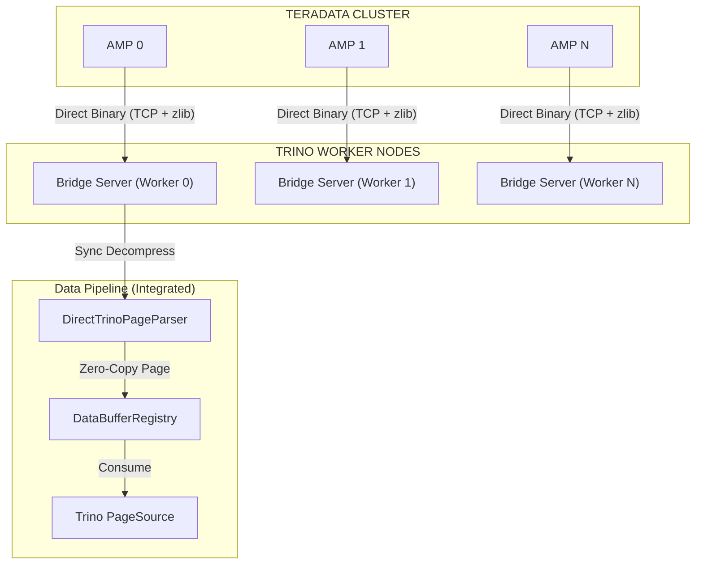

# Teradata to Trino High-Performance Export Connector

A high-performance, massively parallel data export solution from Teradata to Trino using a **Direct Binary Protocol** (Zero-Copy). This connector bypasses traditional JDBC and Apache Arrow overhead for maximum throughput and 100% data reliability.

## Architecture Overview



## Key Design Decisions

1.  **Direct Binary Protocol**: Data is serialized using Teradata's native packed binary format, optionally compressed with zlib, and sent directly via TCP sockets.
2.  **Zero-Copy Execution**: Bypasses Apache Arrow entirely. The `DirectTrinoPageParser` converts binary data directly into Trino `Page` objects, reducing CPU and memory overhead.
3.  **Synchronous & Reliable**: Uses a synchronous processing pipeline in `TeradataBridgeServer` to guarantee 100% data integrity with deterministic End-of-Stream (EOS) detection.
4.  **Massively Parallel**: Leverages Teradata AMP-level parallelism. Each AMP connects to a specific Trino worker using deterministic load balancing (`amp_id % worker_count`).
5.  **Enterprise Security**:
    *   **Proxy Authentication**: Supports `SET QUERY_BAND` to propagate end-user identity.
    *   **Dynamic Token Security**: Every query generates a unique dynamic security token for the socket handshake.
    *   **Credential Masking**: Sensitive information is masked in logs.

## Project Structure

```
tdconnector/
├── src/
│   ├── teradata/
│   │   ├── export_to_trino.c       # C Table Operator (Sends Binary Data)
│   │   └── include/
│   │       └── sqltypes_td.h       # Teradata type definitions
│   └── trino/
│       └── src/main/java/io/trino/plugin/teradata/export/
│           ├── TeradataBridgeServer.java  # Integrated Socket Receiver
│           ├── DirectTrinoPageParser.java # Binary-to-Page Parser
│           ├── DataBufferRegistry.java    # Reliable Buffer Management
│           ├── TrinoExportSplitManager.java # Parallel Split Orchestration
│           └── TrinoExportPageSource.java   # Data Consumption for Trino
├── scripts/
│   ├── register.bteq               # Script to register C UDF on Teradata
│   └── deploy_to_trino.sh          # Deploy connector to Trino Workers
├── tests/
│   ├── run_java_suite.sh           # Modular JUnit 5 test suite (Recommended)
│   ├── run_connector_tests.sh      # Full integration bash suite
│   ├── quick_test.sh               # Rapid query validation
│   └── trino-tests/                # Java/JUnit testing source
├── config/
│   └── teradata-export.properties   # Catalog configuration example
└── docs/
    ├── TECHNICAL_GUIDE_TDEXPORT.md # Detailed technical specifications
    └── IMPLEMENTATION_NOTES.md     # Core design documentation
```

## Quick Reference: Frequently Used Commands

### Build & Deploy (Integrated Cycle)
```bash
export JAVA_HOME=/home/vijay/tdconnector/trino_server/jdk-25.0.1
export TRINO_HOME=/home/vijay/tdconnector/trino_server/trino-server-479
export PATH=$JAVA_HOME/bin:$PATH

cd src/trino && mvn clean package dependency:copy-dependencies -DskipTests && \
/bin/bash ../../scripts/deploy_to_trino.sh && \
$TRINO_HOME/bin/launcher restart --etc-dir=$TRINO_HOME/etc
```

### Run Tests
```bash
# Recommended: Fast, Modular Java Suite
/bin/bash tests/run_java_suite.sh

# Single Query Result Verification
./tests/quick_test.sh "SELECT count(*) FROM tdexport.trinoexport.test_table"
```

### Monitoring
```bash
# Watch Bridge Activity & Query Progress
tail -f $TRINO_HOME/data/var/log/server.log | grep -E "(Bridge|Receiving|processed query)"
```

## Usage

### From Trino CLI
```sql
-- Trigger parallel export from Teradata
SELECT * FROM tdexport.trinoexport.large_table WHERE date_col > DATE '2024-01-01';
```

### From Teradata (Manual UDF Test)
```sql
SELECT * FROM ExportToTrino(
  ON (SELECT TOP 10 * FROM DBC.Tables)
  ON (SELECT '172.27.251.157:9999' as target_ips, 'manual-test' as qid) DIMENSION
) AS t;
```

## Documentation
For more details, please refer to the following documents in the `docs/` directory:
- [Technical Guide](docs/TECHNICAL_GUIDE_TDEXPORT.md): Implementation details, architecture, and configuration.
- [Implementation Notes](docs/IMPLEMENTATION_NOTES.md): Historical context and design rationale.
- [Session Summary](docs/SESSION_SUMMARY.md): Recent development activities.

---
*Last updated: 2025-12-27 - Reflecting Direct Binary Zero-Copy Architecture*
